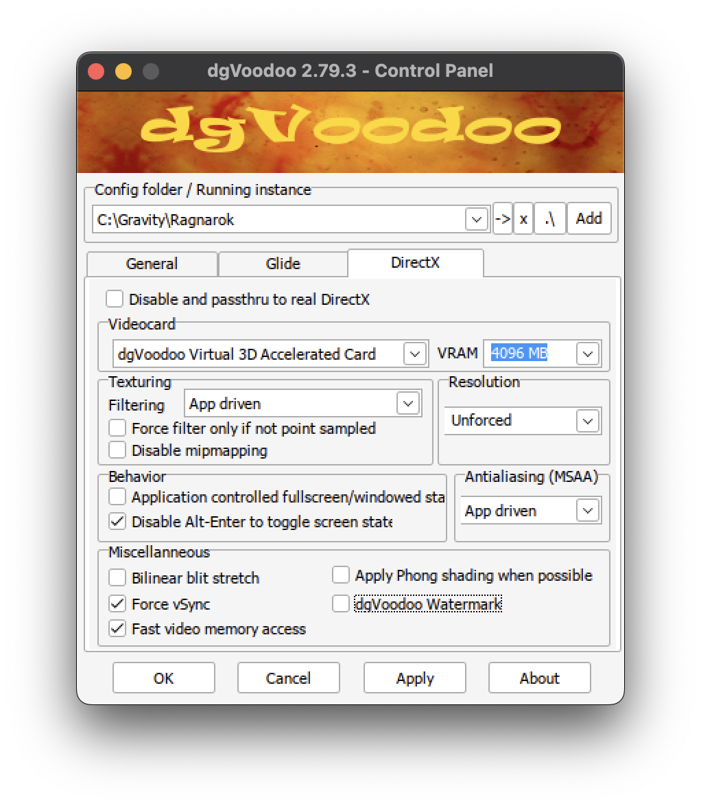
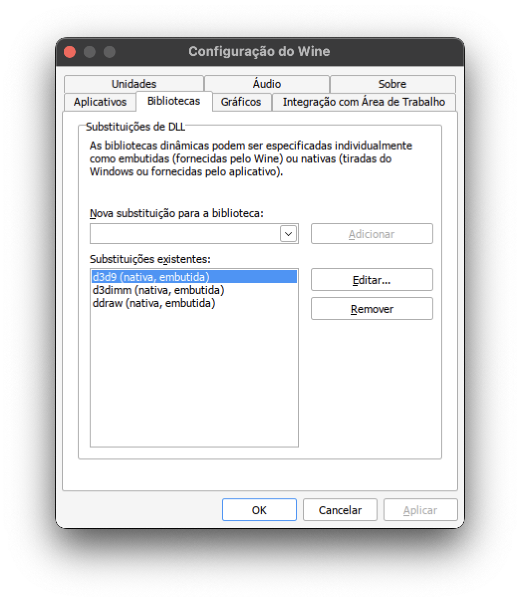

# RO Latam Installation Guide on macOS

## Downloads

- [dgVoodoo2](https://github.com/victormlourenco/RO-Latam-MacOS/raw/refs/heads/main/downloads/dgVoodoo2_79_3.zip)
- [steam.exe (stub)](https://github.com/victormlourenco/RO-Latam-MacOS/raw/refs/heads/main/downloads/steam.exe)


---

## 1. Homebrew Installation
- Go to: [https://brew.sh](https://brew.sh)

---

## 2. Sikarugir Installation
```bash
brew upgrade
brew install --cask --no-quarantine Sikarugir-App/sikarugir/sikarugir
```

---

## 3. Sikarugir Configuration
- Open the **Sikarugir Creator** app.  
- Click the **+** button.

---

## 4. Engine Download
- Select the **WS12WineSikarugir10.0** engine.  
- Click **Download and Install** and confirm with **OK**.

---

## 5. Creating a New Wrapper
- Go back to the Creator’s home screen.  
- Select the engine and click **Create an Empty Wrapper**.  
- Enter a name for the Wrapper and click **OK**.

---

## 6. Opening the Wrapper
- Open **Finder**.  
- Navigate to the folder of the created Wrapper.  
- Double-click to open it.

---

## 7. RO Latam Installation
- Go to **Install Software > Choose Setup Executable**.  
- Add the **RO Latam** installer file and proceed as usual.

---

## 8. Executable Configuration
- After installation, you’ll be prompted to add the executable path.  
- Confirm with **OK**.

---

## 9. Wrapper Adjustments
- Go to `/Users/<user>/Applications/Sikarugir`.  
- Right-click the Wrapper and select **Show Package Contents**.  
- Navigate to `Contents/drive_c` and add the `steam.exe`.

---

## 10. Adding dgVoodoo2 Files
- Copy the following files to `Contents/drive_c/Gravity/Ragnarok`:
  - `MS/x86/ddraw.dll`
  - `MS/x86/d3dImm.dll`
  - `MS/x86/d3d9.dll`
  - `dgVoodoo.conf`
  - `dgVoodooCpl.exe`

> **Info:** dgVoodoo2 versions newer than **2.79.3** don’t work with Wine.

---

## 11. Sikarugir Configuration
- Go back to the **Contents** folder.  
- Run **Configure** and enable the **DXMT** option.

---

## 12. Testing and Configuring dgVoodoo
- Open `dgVoodooCpl.exe` in the Ragnarok directory.  
- Click **Test Run**.  
- Configure according to the illustrations.  
- Click **Apply** and then **OK**.

  
  

---

## 13. Wine Configuration
- In **Configure**, go to **Tool > Config Utility (winecfg)**.  
- In the **Applications** tab, select **Windows 7**.  
- In the **Libraries** tab, add the dgVoodoo2 DLLs.

  
  

---

## 14. Finalizing
- Go to **Configuration > Browser**.  
- Select the `steam.exe`.  
- Click **Test Run** and open **Setup**, choosing **DirectX7**.