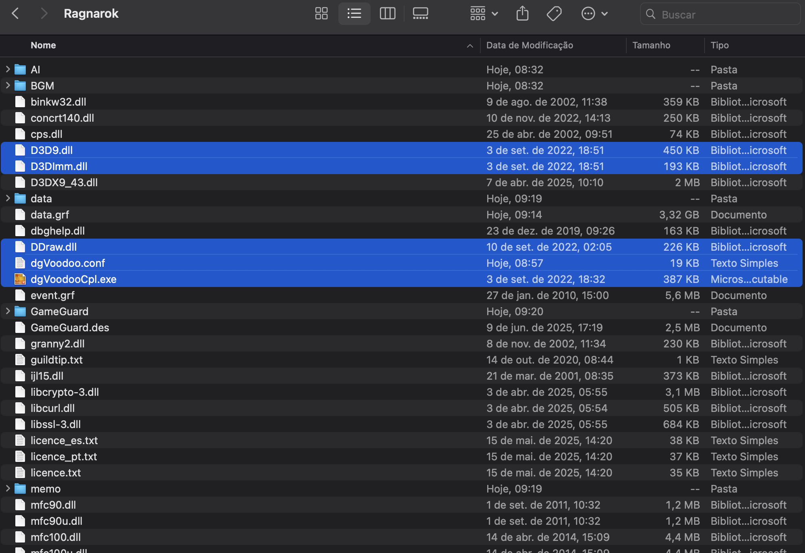
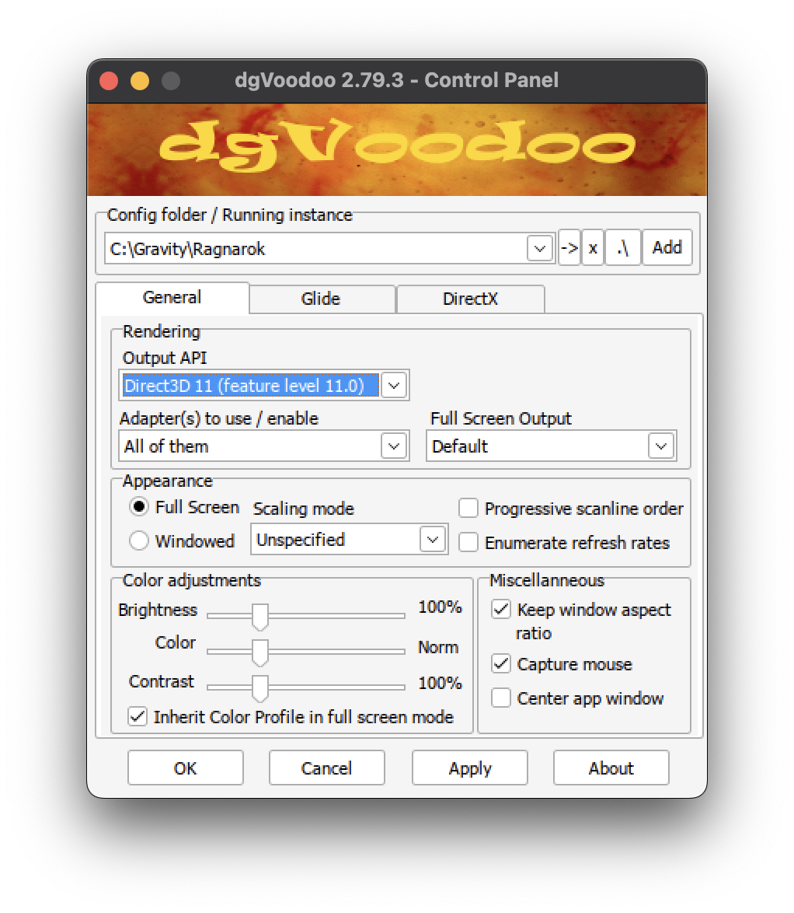
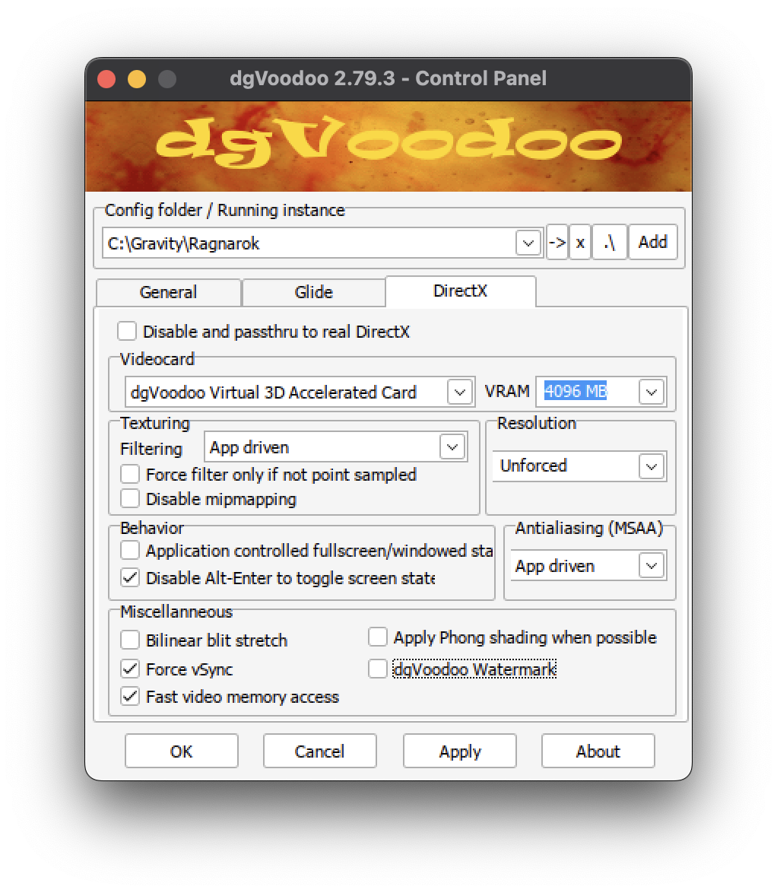
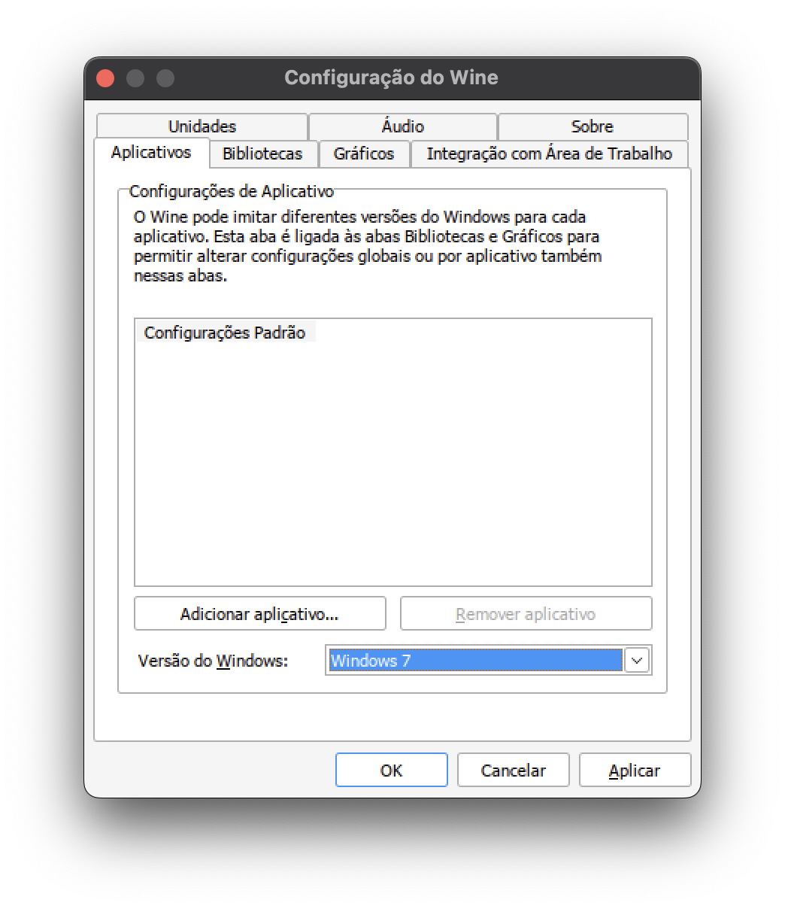
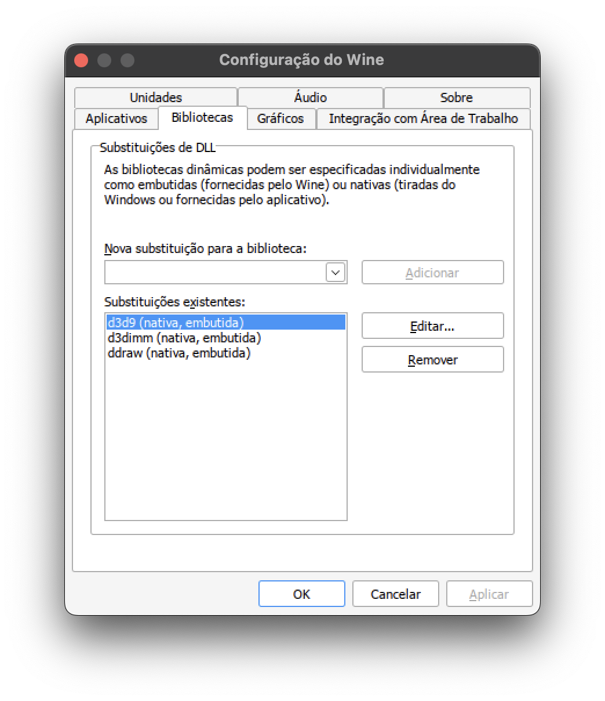

# Guía de Instalación de RO Latam en macOS

## Descargas

- [dgVoodoo2](https://github.com/victormlourenco/RO-Latam-MacOS/raw/refs/heads/main/downloads/dgVoodoo2_79_3.zip)
- [steam.exe (stub)](https://github.com/victormlourenco/RO-Latam-MacOS/raw/refs/heads/main/downloads/steam.exe)

---

## 1. Instalación de Homebrew
- Accede a: [https://brew.sh](https://brew.sh)

---

## 2. Instalación de Sikarugir
```bash
brew upgrade
brew install --cask --no-quarantine Sikarugir-App/sikarugir/sikarugir
```

---

## 3. Configuración de Sikarugir
- Abre la aplicación **Sikarugir Creator**.
- Haz clic en el botón **+**.

---

## 4. Descarga del Engine
- Selecciona el motor **WS12WineSikarugir10.0**.
- Haz clic en **Download and Install** y confirma con **OK**.

---

## 5. Creación de un Nuevo Wrapper
- Vuelve a la pantalla inicial del Creator.
- Selecciona el motor y haz clic en **Crear un Nuevo Wrapper Vacío**.
- Introduce un nombre para el Wrapper y haz clic en **OK**.

---

## 6. Apertura del Wrapper
- Abre el **Finder**.
- Navega hasta la carpeta del Wrapper creado.
- Haz doble clic para abrirlo.

---

## 7. Instalación de RO Latam
- Accede a **Install Software > Choose Setup Executable**.
- Añade el archivo de instalación de **RO Latam** y procede normalmente.

---

## 8. Configuración del Ejecutable
- Después de la instalación, se te pedirá añadir la ruta del ejecutable.
- Confirma con **OK**.

---

## 9. Ajustes en el Wrapper
- Ve a `/Users/<usuario>/Applications/Sikarugir`.
- Haz clic derecho en el Wrapper y selecciona **Mostrar Contenido del Paquete**.
- Navega hasta `Contents/drive_c` y añade el archivo `steam.exe`.

---

## 10. Adición de Archivos de dgVoodoo2
- Copia los siguientes archivos a `Contents/drive_c/Gravity/Ragnarok`:
  - `MS/x86/ddraw.dll`
  - `MS/x86/d3dImm.dll`
  - `MS/x86/d3d9.dll`
  - `dgVoodoo.conf`
  - `dgVoodooCpl.exe`

> **Info:** Las versiones más nuevas de dgVoodoo2 (superiores a la **2.79.3**) no funcionan con Wine.



---

## 11. Configuración de Sikarugir
- Vuelve a la carpeta **Contents**.
- Ejecuta **Configure** y activa la opción **DXMT**.

---

## 12. Prueba y Configuración de dgVoodoo
- Abre `dgVoodooCpl.exe` en el directorio de Ragnarok.
- Haz clic en **Test Run**.
- Configura según las ilustraciones.
- Haz clic en **Apply** y luego en **OK**.

  
  

---

## 13. Configuración de Wine
- En **Configure**, ve a **Tool > Config Utility (winecfg)**.
- En la pestaña **Aplicaciones**, selecciona **Windows 7**.
- En la pestaña **Bibliotecas**, añade las DLLs de dgVoodoo2.

  
  

---

## 14. Finalización
- Ve a **Configuration > Browser**.
- Selecciona el `steam.exe`.
- Haz clic en **Test Run** y abre el **Setup** del juego, eligiendo **DirectX7**.