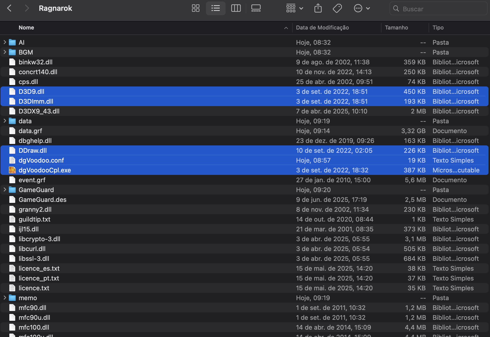
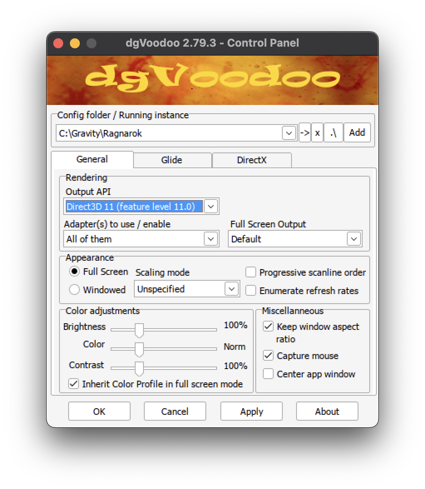
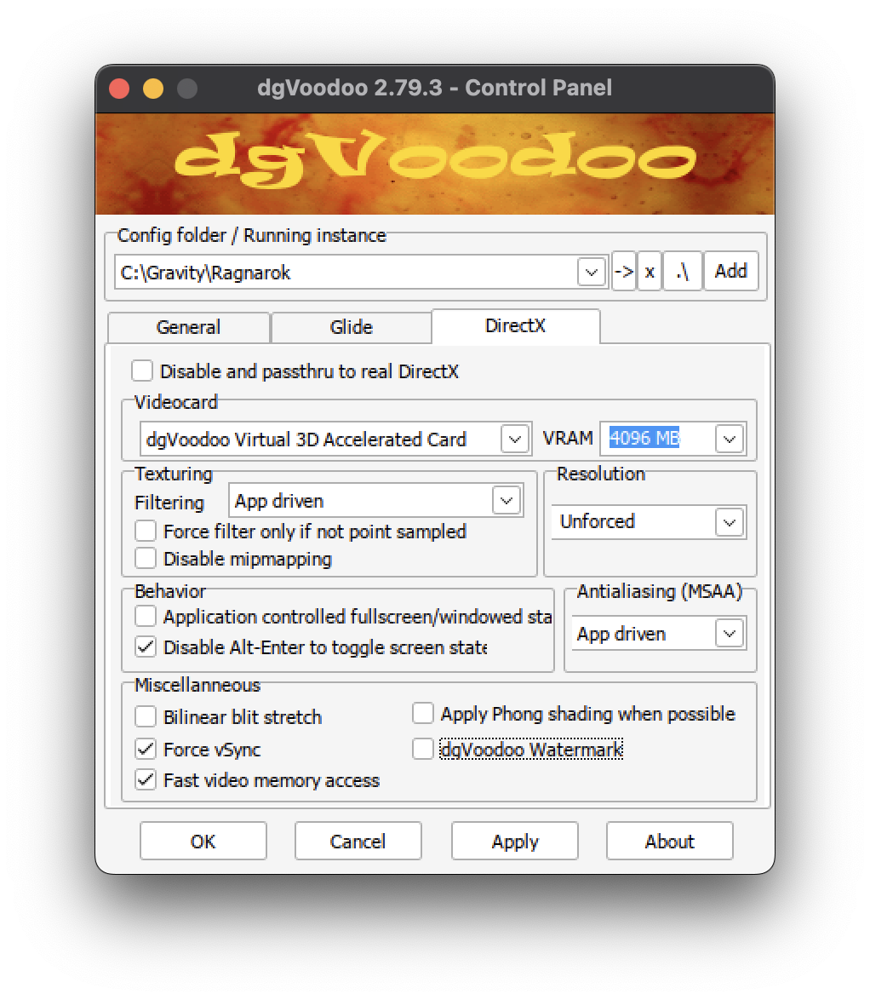
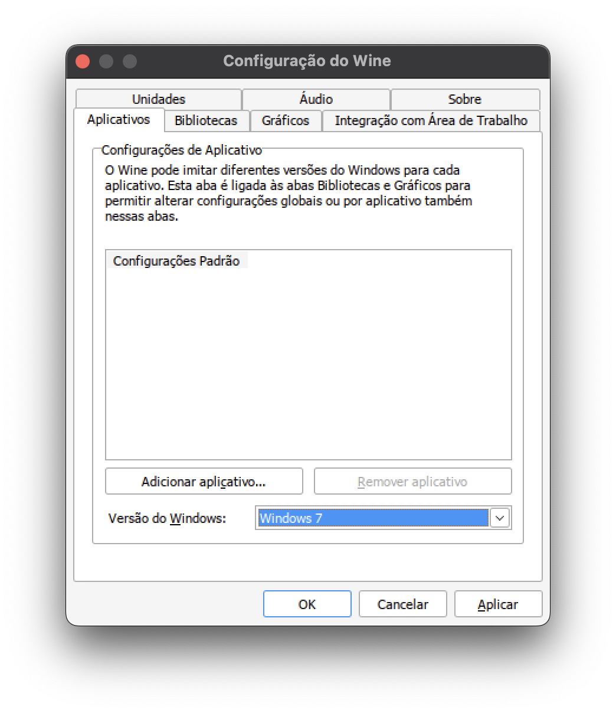
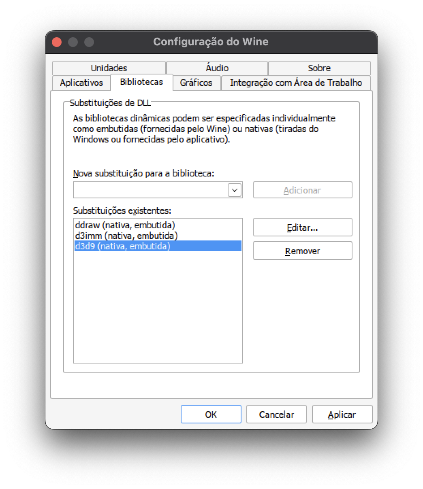

# Guia de Instalação do RO Latam no macOS

## Downloads

- [dgVoodoo2](https://github.com/victormlourenco/RO-Latam-MacOS/raw/refs/heads/main/downloads/dgVoodoo2_79_3.zip)
- [steam.exe (stub)](https://github.com/victormlourenco/RO-Latam-MacOS/raw/refs/heads/main/downloads/steam.exe)

---

## 1. Instalação do Homebrew
- Acesse: [https://brew.sh](https://brew.sh)

---

## 2. Instalação do Sikarugir
```bash
brew upgrade
brew install --cask --no-quarantine Sikarugir-App/sikarugir/sikarugir
```

---

## 3. Configuração do Sikarugir
- Abra o aplicativo **Sikarugir Creator**.
- Clique no botão **+**.

---

## 4. Download da Engine
- Selecione a engine **WS12WineSikarugir10.0**.
- Clique em **Download and Install** e confirme com **OK**.

---

## 5. Criação de um Novo Wrapper
- Volte à tela inicial do Creator.
- Selecione a engine e clique em **Criar um Novo Wrapper Vazio**.
- Insira um nome para o Wrapper e clique em **OK**.

---

## 6. Abertura do Wrapper
- Abra o **Finder**.
- Navegue até a pasta do Wrapper criado.
- Clique duas vezes para abrir.

---

## 7. Instalação do RO Latam
- Acesse **Install Software > Choose Setup Executable**.
- Adicione o arquivo de instalação do **RO Latam** e prossiga normalmente.

---

## 8. Configuração do Executável
- Após a instalação, será solicitado adicionar o caminho do executável.
- Confirme com **OK**.

---

## 9. Ajustes no Wrapper
- Vá até `/Users/<usuário>/Applications/Sikarugir`.
- Clique com o botão direito no Wrapper e selecione **Mostrar Conteúdo do Pacote**.
- Navegue até `Contents/drive_c` e adicione o `steam.exe`.

---

## 10. Adição dos Arquivos do dgVoodoo2
- Copie os seguintes arquivos para `Contents/drive_c/Gravity/Ragnarok`:
  - `MS/x86/ddraw.dll`
  - `MS/x86/d3Imm.dll`
  - `MS/x86/d3d9.dll`
  - `dgVoodoo.conf`
  - `dgVoodooCpl.exe`

> **Info:** Versões mais novas do dgVoodoo2 (acima da **2.79.3**) não funcionam com o Wine.



---

## 11. Configuração do Sikarugir
- Volte para a pasta **Contents**.
- Execute o **Configure** e ative a opção **DXMT**.

---

## 12. Teste e Configuração do dgVoodoo
- Abra o `dgVoodooCpl.exe` no diretório do Ragnarok.
- Clique em **Test Run**.
- Configure conforme as ilustrações.
- Clique em **Apply** e depois em **OK**.

  
  

---

## 13. Configuração do Wine
- No **Configure**, vá em **Tool > Config Utility (winecfg)**.
- Na aba **Aplicativos**, selecione **Windows 7**.
- Na aba **Bibliotecas**, adicione as DLLs do dgVoodoo2.

  
  

---

## 14. Finalização
- Vá em **Configuration > Browser**.
- Selecione o `steam.exe`.
- Clique em **Test Run** e abra o **Setup** do jogo, escolhendo o **DirectX7**.